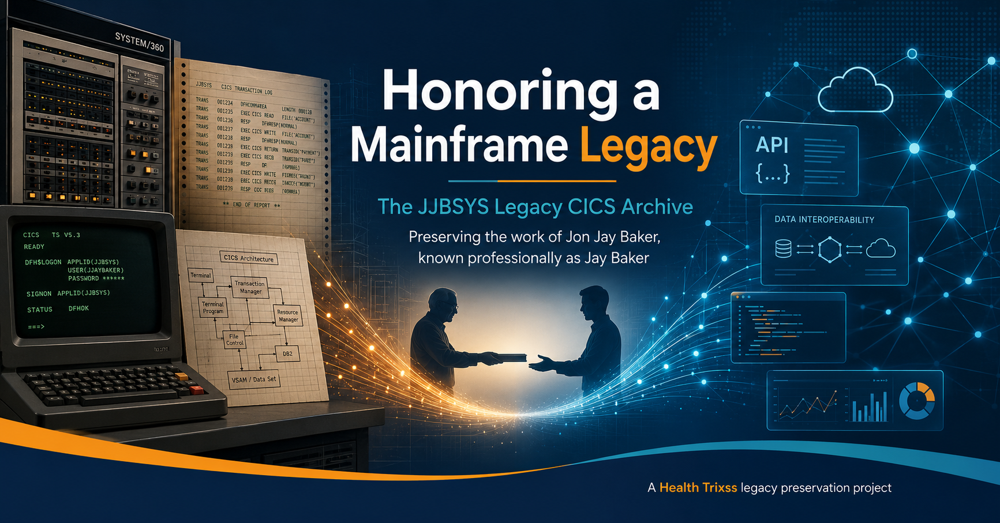

<p align="center">
  
</p>

# JJBSYS Legacy CICS Mainframe Archive

> Honoring a mainframe legacy through preservation, documentation, and careful public review.

## Overview

JJBSYS-Legacy is a preserved CICS/mainframe systems programming archive that documents real-world patterns for batch-to-CICS integration, CICS operations automation, TCP/IP and SMTP connectivity, CICS web support, terminal and exit management, and legacy modernization analysis.

This repository exists to honor the original author’s technical legacy and help future engineers study, understand, review, and modernize legacy IBM CICS and z/OS environments.

## Purpose

The purpose of this project is to preserve and document a substantial body of legacy mainframe systems programming work in a form that can be reviewed publicly, discussed responsibly, and used as a reference for historical understanding and modernization planning.

This is a historical and educational preservation archive. It is not represented as production-ready software.

## About the Legacy

This archive preserves source members associated with a real-world CICS/mainframe codebase, including CICS resource support, batch integration tooling, TCP/IP and SMTP integration routines, CICS web components, user exits, terminal management utilities, operational automation, and related infrastructure members.

The project exists to preserve and document the technical legacy of the original author and to give current and future engineers a practical view into how enterprise mainframe environments were extended and operated.

## What Problem This Code Solved

The source in this repository appears to support the day-to-day engineering realities of a CICS environment rather than a single end-user application. In broad terms, the code helped solve problems such as:

- Connecting batch jobs and non-CICS processes to CICS services through structured bridge patterns.
- Automating routine CICS operational tasks, startup and shutdown behavior, and system support workflows.
- Extending CICS with TCP/IP, SMTP, HTTP, and web-facing integration capabilities.
- Managing terminal, autoinstall, exit, and systems-level control logic in a production-style mainframe environment.
- Providing reusable patterns for systems programming, operational tooling, and modernization analysis.

## Major Functional Areas

- CICS systems programming members and resource-related utilities.
- Assembler, COBOL, and JCL members used for build, generation, and runtime support.
- EXCI bridge programs and batch-to-CICS integration patterns.
- TCP/IP sockets, SMTP mail, HTTP, and external integration utilities.
- CICS Web Interface support, web analyzers, converters, and state-related routines.
- User exits, terminal autoinstall logic, and operational automation utilities.
- PLT startup and shutdown members, region support, monitoring, and operational control artifacts.

The repository includes CICS, assembler, COBOL, JCL, EXCI bridge, TCP/IP, SMTP, CICS Web Interface, user exits, terminal autoinstall, and operational automation components.

## Repository Structure

This repository primarily contains flat source members named according to legacy conventions. A few useful top-level groupings are:

- `$GEN*` members: generation, build, or compile-oriented JCL/procedure members.
- `DFH*` members: CICS-related samples, tables, exits, PLT definitions, and support components.
- `IEB*` members: batch-to-CICS, EXCI bridge, and CICS resource access utilities.
- `IEP*` members: CICS operations and support utilities.
- `IET*` members: TCP/IP, SMTP, HTTP, UPS-style integration, and external communication routines.
- `IEW*` members: CICS web interface support and related web-processing logic.
- `IEX*` members: user exits.
- `IEIAIT` and `IEMAIT`: terminal autoinstall support.
- `OHCI*` and `OJCI*` members: SMP/E, modification, or CICS change support artifacts.
- `TCC*` members: TCP/IP-related examples or integration support members.
- `docs/`: static GitHub Pages documentation for architecture, components, and review guidance.

## Public Use and Safety Notice

This repository should be approached as a legacy archive and technical reference collection, not as a deployable application.

Anyone considering compilation, adaptation, installation, or operational reuse should expect to perform expert CICS, z/OS, security, compliance, and local-environment review first. Site-specific values, operational assumptions, legacy interfaces, and compatibility concerns may still require careful evaluation.

## Open Source Readiness

The repository has been prepared for public review by replacing obvious secrets and by adding documentation, governance, and reviewer guidance. It remains a legacy archive, not a finished product.

Review these supporting documents before deeper source analysis:

- [OPEN_SOURCE_RELEASE.md](OPEN_SOURCE_RELEASE.md)
- [PUBLIC_READINESS_CHECKLIST.md](PUBLIC_READINESS_CHECKLIST.md)
- [REVIEW_GUIDE.md](REVIEW_GUIDE.md)
- [DISCLAIMER.md](DISCLAIMER.md)
- [SECURITY.md](SECURITY.md)

## Documentation Site

The repository includes a static GitHub Pages documentation site under [`docs/`](docs/README.md).

**Start here:**

| Destination | Why it matters |
| --- | --- |
| [docs/index.html](docs/index.html) | Main entry point for the archive experience |
| [docs/architecture.html](docs/architecture.html) | High-level conceptual architecture |
| [docs/component-inventory.html](docs/component-inventory.html) | Fast way to understand member prefixes |
| [docs/exci-bridge.html](docs/exci-bridge.html) | Batch-to-CICS bridge explanation |
| [docs/cics-operations.html](docs/cics-operations.html) | Operational utilities and region support |
| [docs/tcpip-smtp-web.html](docs/tcpip-smtp-web.html) | External integration patterns |
| [docs/modernization-map.html](docs/modernization-map.html) | Modernization directions to evaluate |
| [docs/author-legacy.html](docs/author-legacy.html) | Legacy and attribution page |

```text
CICS TS V3 READY
SIGNON APPLID(JJBSYS-LEGACY)
USERID(REVIEWER)
PASSWORD(********)

NEXT STEPS
  1. READ README
  2. OPEN docs/index.html
  3. REVIEW component-inventory.html
  4. TRACE SOURCE MEMBERS BY PREFIX
  5. REPORT SENSITIVE FINDINGS PRIVATELY
```

## How to Review This Repository

For a structured review path:

1. Start with this README.
2. Read [OPEN_SOURCE_RELEASE.md](OPEN_SOURCE_RELEASE.md) for sanitization and release notes.
3. Read [REVIEW_GUIDE.md](REVIEW_GUIDE.md) for a suggested expert review workflow.
4. Use the documentation site to understand file prefixes, architecture, and modernization directions.
5. Review source members conservatively and assume expert validation is needed before making deployment conclusions.

## Contribution Policy

This is a preservation and documentation project. Preferred contributions focus on:

- Documentation improvements.
- Component explanations and source classification.
- Historical context and reviewer notes.
- Modernization mappings and architectural interpretation.
- Public-readiness and sanitization review.

Please read [CONTRIBUTING.md](CONTRIBUTING.md) before opening a pull request.

## License

This repository is licensed under the Apache License, Version 2.0. See [LICENSE](LICENSE).

## Maintainer Notes

- This project exists to preserve and document the technical legacy of the original author.
- It may require expert CICS and z/OS review before any attempt to compile, install, adapt, or modernize the source.
- Reviewers should avoid posting secrets, private hostnames, credentials, or operationally sensitive findings publicly.
- GitHub Pages instructions are documented in [docs/README.md](docs/README.md).
